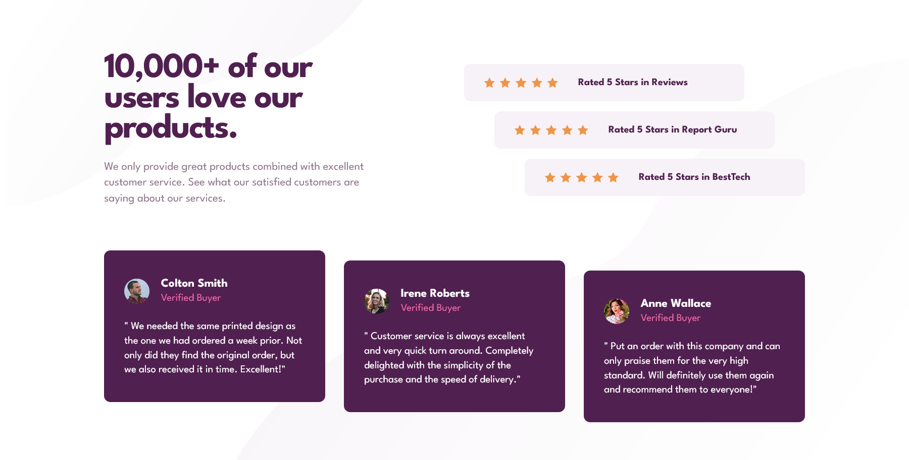

# Frontend Mentor - Social proof section solution

This is a solution to the [Social proof section challenge on Frontend Mentor](https://www.frontendmentor.io/challenges/social-proof-section-6e0qTv_bA).

### Screenshot

### Links

- Solution URL: [Solution URL here](https://www.frontendmentor.io/solutions/social-proof-section-q_vc4ng3Qg)
- Live Site URL: [Live site URL here](https://donjr2.github.io/Frontend-Mentor---Social-proof-section-solution/)

### Built with

- Semantic HTML5 markup
- CSS custom properties
- Flexbox

## Author

- Frontend Mentor - [@Tuhin-jr](https://www.frontendmentor.io/profile/Tuhin-jr)
